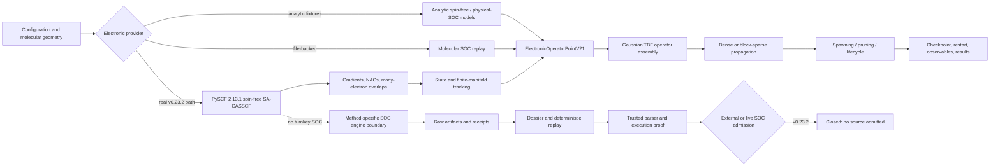

# v0.23.2 program architecture

## Primary data contracts

| Contract | Pertinent information |
|---|---|
| Electronic point | Complex Hermitian H and physical derivative matrices K for every coordinate |
| Derivative connection | Anti-Hermitian `D[i,j]=<Phi_i|d Phi_j>` in inverse bohr |
| Snapshot overlap | Identity on self, adjoint reciprocity, contractive cross singular values |
| Provider provenance | Exact method, units, model space, symmetry, runtime, and calculation identity |
| Gaussian state | Centers, momenta, complex widths, electronic blocks, stable IDs, sparse-edge state |
| Checkpoint | Full propagated state plus provider/settings fingerprint and integrity digest |
| SOC evidence | Raw artifacts, receipts, convergence, replay, dossier, parser proof, execution proof |

## Release status

The Gaussian propagation core, analytic physical-SOC fixtures, real PySCF
spin-free SA-CASSCF runtime, analytic gradients, NAC/overlap consistency, overlap
contractions, and 168-gate campaign are validated. The method-specific
state-interaction SOC engine, physical molecular-SOC derivatives, external/live
SOC admission, and ab-initio SOC accuracy remain outside the validated boundary.

An interactive, viewable companion diagram is delivered with the release build.
