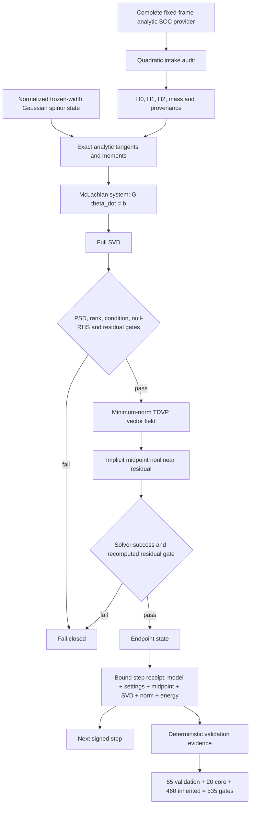

# v0.25.1 program architecture



Text fallback:

```text
fixed-frame provider --quadratic/provenance audit--> H0,H1,H2,m
                                                       |
normalized {q,p,width,C} --exact moments/tangents-------+
                                                       v
                                           G(theta) theta_dot = b(theta)
                                                       |
                                      full SVD + compatible-null audit
                                                       |
                                               v(theta)=G+ b
                                                       |
                           theta_1-theta_0-h v((theta_0+theta_1)/2)=0
                                                       |
                                      nonlinear success + residual audit
                                                       |
                          endpoint + metric/SVD/norm/energy/model receipt
                                                       |
                         validation, fingerprint, reversal, next signed step
```

## Module ownership

- `multigaussian_tdvp_v251.py`: state/model contracts, analytic moments, tangent
  system, SVD solve, implicit step, trajectory, receipts, and frozen claims.
- `multigaussian_tdvp_validation_v251.py`: deterministic even/odd, reversal,
  permutation, constant-gauge, null-space, harmonic, zero-SOC, and convergence data.
- `v251_benchmark.py`: 20 adversarial controls and cumulative inheritance of all
  460 v0.25.0 gates.
- `examples/133_*` and `134_*`: canonical JSON evidence/campaign regeneration.

## Deliberately disconnected branches

The v0.25.1 solver does not route through adaptive spawning, pruning, old classical
center guidance, coordinate-dependent electronic gauge transport, multidimensional
Gaussian tensors, or live/static PySCF SOC objects. These capabilities require later
contracts rather than implicit conversion.

