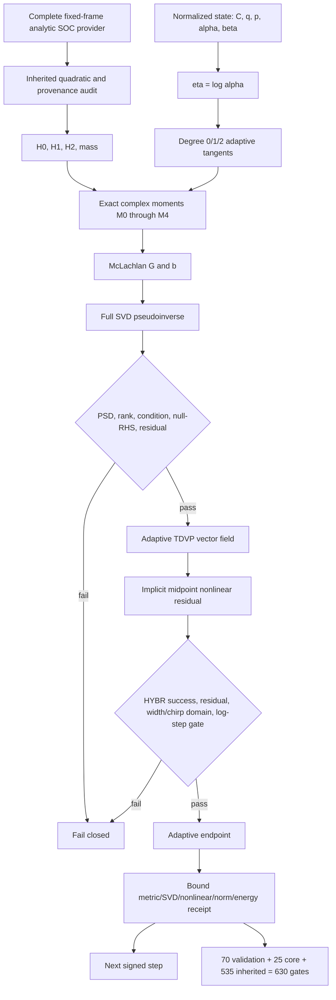

# v0.25.2 program architecture



Text fallback:

```text
fixed-frame quadratic H + {C,q,p,alpha,beta}
                |          alpha=exp(eta)>0
                +------------------+
                                   v
                 exact chirped moments M0...M4
                                   |
                         G(theta) theta_dot=b(theta)
                                   |
                  full SVD + compatible-null audit
                                   |
              theta1-theta0-h*v((theta0+theta1)/2)=0
                                   |
             HYBR success + residual + width/chirp gates
                                   |
             endpoint and fingerprint-bound step receipt
```

## Module ownership

- `adaptive_multigaussian_tdvp_v252.py`: adaptive state, exact moments/matrices,
  tangents, metric, implicit step, receipts, trajectory, and frozen claims.
- `adaptive_multigaussian_tdvp_validation_v252.py`: even/odd, reversal, adaptive
  motion, covariance, null-space, harmonic, coherent reduction, zero-SOC, and order
  evidence.
- `v252_benchmark.py`: 25 adversarial gates and inheritance of all 535 v0.25.1
  checks.

Spawning/pruning, multidimensional/full-matrix widths, coordinate-dependent
electronic frames, and real molecular providers have no route into this runner.

