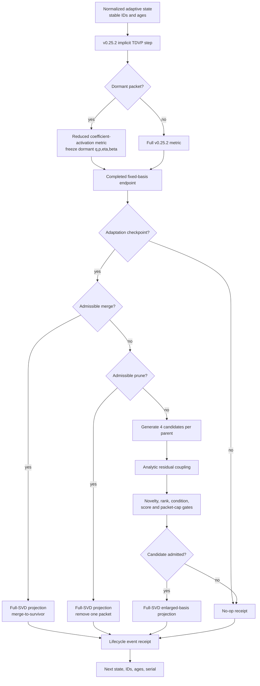

# v0.25.3 program architecture



Text fallback:

```text
state -> fixed-basis TDVP/activation -> checkpoint
      -> merge gate -> prune gate -> residual-spawn gate -> no-op
      -> one SVD-bound event -> updated state + stable metadata
```

Primary modules:

- `adaptive_multigaussian_tdvp_v252.py`: unchanged fixed-basis variational kernel.
- `controlled_basis_adaptation_v253.py`: candidates, projection, activation,
  lifecycle events, and variable-basis trajectory.
- `controlled_basis_validation_v253.py`: 60 deterministic scientific gates.
- `v253_benchmark.py`: 715-gate cumulative campaign.
