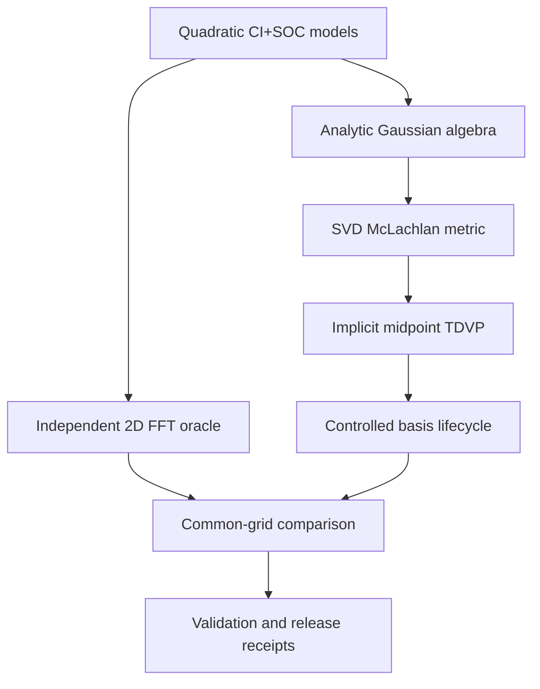
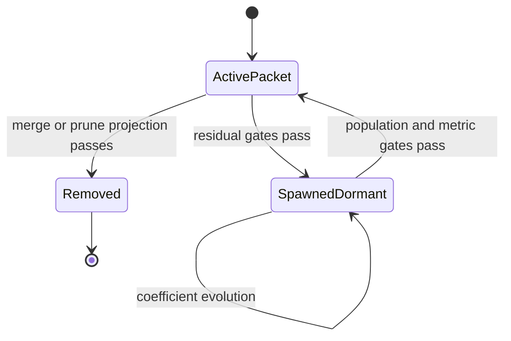
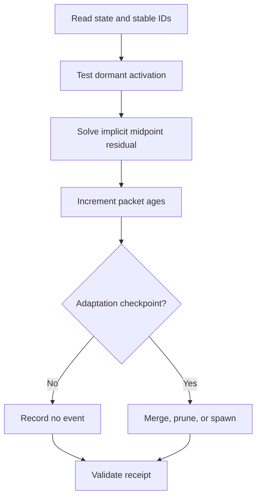

# v0.26.0 Program Architecture

## Component map

| Module | Responsibility | Must not depend on |
|---|---|---|
| `multidimensional_soc_v260.py` | Quadratic models, complete spin spaces, exact 2D FFT propagation | Gaussian moments, TDVP, spawning |
| `multidimensional_gaussian_tdvp_v260.py` | Cross moments, S/H matrices, tangents, SVD metric, midpoint solve | Exact-grid propagation |
| `multidimensional_basis_adaptation_v260.py` | Candidates, residual scoring, projection, activation, lifecycle | Grid-derived candidate scores |
| `multidimensional_validation_v260.py` | Independent comparisons, reductions, symmetries, lifecycle evidence | Self-asserted release claims |
| `v260_benchmark.py` | Inherited and new acceptance aggregation | Unvalidated mutable thresholds |

## State transition

## Per-step sequence

## Independence boundary

The exact and variational branches meet only when normalized wavefunctions or
reduced electronic densities are compared.  The exact branch does not call analytic
Gaussian integrals.  The variational branch does not use grid quadrature to assemble
its equations.

## Public artifacts

- `results/v0260_multidimensional_evidence.json`
- `results/v0260_multidimensional_campaign.json`
- `examples/139_recompute_v0260_multidimensional.py`
- `examples/140_recompute_v0260_campaign.py`
