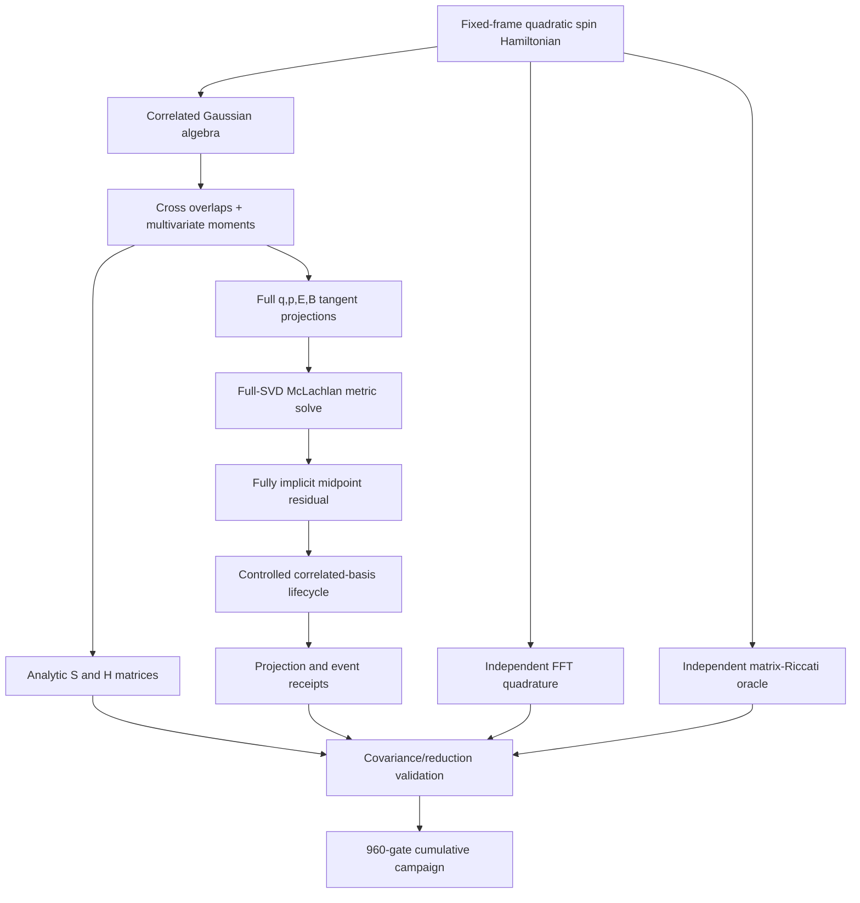

# v0.27.0 Program Architecture

## Component map

| Module | Responsibility | Independence boundary |
|---|---|---|
| `correlated_gaussian_tdvp_v270.py` | SPD/log width algebra, moments, S/H, tangents, SVD metric, midpoint propagation | Does not use FFT or Riccati reference integration |
| `correlated_basis_adaptation_v270.py` | Intrinsic candidates, residual scoring, projection, activation, merge/prune/spawn | Does not use grid-derived scores |
| `correlated_validation_v270.py` | FFT quadrature, Riccati oracle, reductions, covariance, lifecycle evidence | Does not trust release claims as evidence |
| `v270_benchmark.py` | 825 inherited plus 135 new acceptance gates | Thresholds and counts are frozen |
| `multidimensional_soc_v260.py` | Shared fixed-frame quadratic Hamiltonian and exact-grid primitives | Remains independent of correlated TDVP |

## Per-step state transition

```mermaid
stateDiagram-v2
    [*] --> Active
    Active --> Midpoint: assemble metric at nonlinear midpoint
    Midpoint --> Active: converged fixed topology
    Active --> DormantNewborn: residual spawn passes
    DormantNewborn --> DormantNewborn: coefficients evolve; full shape frozen
    DormantNewborn --> Active: population and metric gates pass
    Active --> Removed: merge or prune projection passes
    Removed --> [*]
```

## Data layout

For $G$ packets, $S$ electronic states, and $D$ coordinates, with
$K=D(D+1)/2$,

$$
P=2GS+2GD+2GK
$$

real parameters are packed in the order `Re(C), Im(C), q, p, svec(E), svec(B)`.
All receipts store enough state, settings, spectra, and nonlinear diagnostics to be
revalidated after serialization.

## Public artifacts

- `results/v0270_correlated_evidence.json`
- `results/v0270_correlated_campaign.json`
- `examples/142_recompute_v0270_correlated.py`
- `examples/143_recompute_v0270_campaign.py`
- `examples/144_run_v0270_rotation_demo.py`
