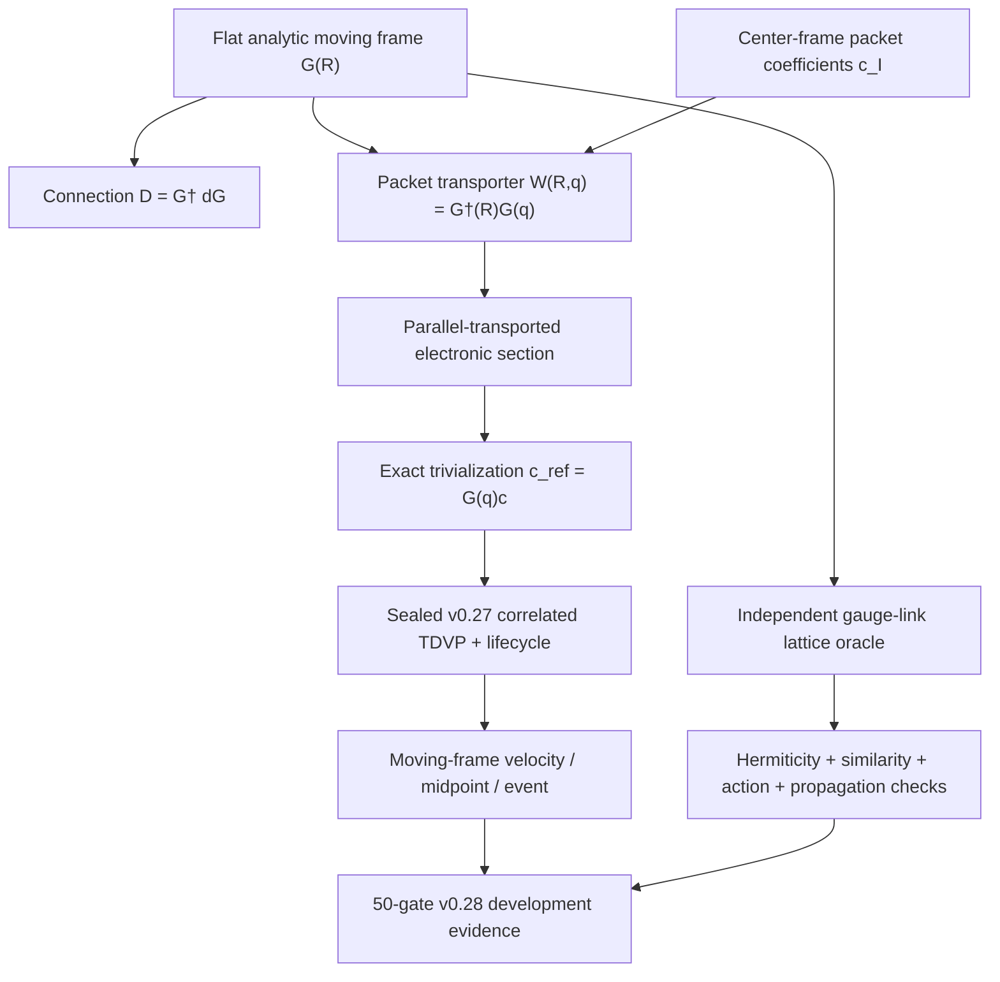

# v0.28.0 Program Architecture

New modules are `moving_frame_v280.py`, `moving_frame_validation_v280.py`, and
`moving_frame_evidence_v280.py`. The v0.27 mathematical modules remain unchanged and
serve as the fixed-frame physical reference for the admitted flat gauge class.
